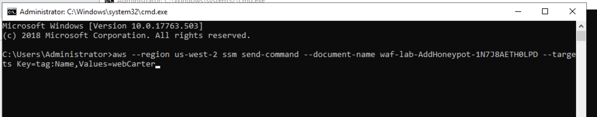

Lab 2 -- Automating Protections and Tracking Attacks
====================================================

**Step 1: Associate WebCarter ALB with WAF-Automation Web ACL.**

1.  Go to AWS WAF & Shield console, choose the region you're working at,
    and open "WebCarter-lab1" Web ACL and navigate to the "Rules" tab on
    the right.

2.  In "AWS resources using this web ACL" delete association with
    WebCarter ALB.

3.  Choose WAF-automation Web ACL and open "Rules" tab.

4.  Click "Add association", then choose "Application load balancer" as
    "Resource type" and choose your WebCarter load balancer. Click
    "Add".

Now your WebCarter Web application protected with Web ACL created by
WAF-automation template.

**Step 2: Configure Web ACL full logging functionality.**

WAF Automation stack created Kinesis Firehose stream that points to ElasticSearch domain. You will configure the Web ACL logging stream JSON WAF logs to the Kinesis Data Firehose.

Kinesis Data Firehose also places a backup copy of the WAF to an S3 bucket for Amazon Athena analysis. 

1.	Open "Logging" tab of the WAF-automation Web ACL and click "Edit".

2.	Choose Kinesis Data Firehose stream created by waf-automation CloudFormation template. 

3.	Don't add "Redacted Fields" and click "Create".

4.	RDP to the Attacker Windows instance and run BOT1 Jmeter scenario to generate data flowing to Kinesis Data Firehose then to ElasticSearch domain.


**Step 3: Configure ElasticSearch with Kibana**

WAF Automation stack created Kinesis Firehose stream pointing to
ElasticSearch domain. You will configure the Web ACL logging stream JSON
WAF logs to the Kinesis Data Firehose.

Kinesis Data Firehose also places a backup copy of the WAF to an S3
bucket for Amazon Athena analysis.

Below you will create indexes and visualizations in your domain.

1.  Go to ElasticSearch console, choose the domain created by
    waf-automation template, and click on the Kibana link:


2.  On the Kibana console click on "Get to work" and create an index
    using the following statement:

> *PUT \_template/awswaf-logs*
>
> *{*
>
> *\"index\_patterns\": \[\"awswaf-\*\"\],*
>
> *\"settings\": {*
>
> *\"number\_of\_shards\": 1*
>
> *},*
>
> *\"mappings\": {*
>
> *\"waflog\": {*
>
> *\"properties\": {*
>
> *\"httpRequest\": {*
>
> *\"properties\": {*
>
> *\"clientIp\": {*
>
> *\"type\": \"keyword\",*
>
> *\"fields\": {*
>
> *\"keyword\": {*
>
> *\"type\": \"ip\"*
>
> *}*
>
> *}*
>
> *}*
>
> *}*
>
> *},*
>
> *\"timestamp\": {*
>
> *\"type\": \"date\",*
>
> *\"format\": \"epoch\_millis\"*
>
> *}*
>
> *}*
>
> *}*
>
> *}*
>
> *}*

Paste this statement in Kibana console and click on the green "play"
bottom to execute it:


3.  Click on the "Discover" menu, define an index pattern as *awswaf-\**
    and click "Next step":

> 
> 

4.  Choose timestamp as a Filter and click "Create index pattern"


5.  Now you're able to run searches through your logs by going into
    the Discover tab in Kibana. For example, you can look for specific
    HTTP headers, query strings, or source IP addresses:

> Now upload visualizations and a dashboard. You can always customize
> them or create your visualizations as required.

6.  Go to "Management" menu and click "Advanced". Search for the the
    defaultindex and copy and save the default index id value:

> 
> 

7.  Open kibana-configruation.json file from the config directory on
    Github, and replace the
    _YOUR_ES_INDEX_ value
    with the one saved above. Please do it everywhere in the file.

8.  Save the file.

9.  Go to "Saved Objects" tab, click "Import" and upload the modified
    kibana-configruation.json file. Click "Yes" for the overwrite
    question.

10. You'll see your dashboard and visualizations have been uploaded
    successfully:

> 
> 

11. Navigate to the "Dashboard" menu and choose "WAF" dashboard you just
    uploaded.


**Step 4: Use ElasticSearch Service with Kibana for WAF monitoring and
forensics**

1. On the Attacker Windows instance, check if BOT1 Jmeter scenario is still running. Re-start it if needed to generate more data for this exercise.

2.  Go to AWS Console and choose ElasticSearch service. Choose your
    waf-automation domain and click on the Kibana link.

3.  Navigate to the "Dashboard" menu on the right and explore the
    dashboard graphs. Check the number of requests per minute per source
    IP address.

4.  Go to AWS WAF & Shield console, choose "IP addresses" menu and check
    if IP addresses you see in the Kibana charts appear in any of the
    block lists.

**QUESTION**: Should the source IP addresses for BOT1 scenario appear in
any of the block lists?

This scenario simulates a mix of legitimate traffic together with under
the radar BOT traffic.

5.  Go back to Kibana "Dashboard" GUI and scroll down to "Allow/block
    URIs". Note that /login page is one of the top requested URIs.

6.  Go to "Discover" menu and enter the following search filter:

*httpRequest.uri:/user/login*

7.  Scroll through some of the requests and note that at glance, they're
    coming from the same source IP address.

8.  Enter the following search filter.

*!httpRequest.uri:/user/login && httpRequest.clientIp:10.192.30.50*

**QUESTION**: *Do these requests look legit? In the real-life scenario
why can we see large number of malicious and legitimate requests coming
from the same IP address?*

*Can we just block all requests coming from that IP address?*

*Can we block all requests to this URI?*

9.  Look at the User-Agent header value for the requests returned by the
    search below:

*httpRequest.uri:/user/login && httpRequest.clientIp:10.192.30.50*

Note that large number of requests has User-Agent value "IamaBOT". We'll
create a WAF rule that blocks these requests below.

10. Go to AWS WAF & Shield console and navigate to "String and regex
    matching".

11. Click "Create condition" and create BOT10 condition as following:


12. Click "Add filter" then "Create".

13. Go to "Rules" menu and click "Create rule".

14. Create BOT10 rule as following:


15. Click "Create".

16. Navigate to "Web ACLs" menu and click on "WAF-Automation.." ACL.

17. Click "Rules" tab then "Edit Web ACL" button.

18. In the "Rules" drop-down list choose BOT10 rule and click "Add rule
    to Web ACL".

19. Assure rule action set to "Block" and click "Update".

20. Wait for couple for minutes and refresh Kibana dashboard. Check if
    you see blocked request to the login page.

21. Note the "Terminating Rule ID" in the "WAF Rules Hit" visualization
    and check the rule that block these requests. To do so, run the
    following AWS CLI command. Update the region and the rule id as
    required:

*aws waf-regional get-rule \--region us-west-2 \--rule-id
d3458c9b-5bba-4361-a7ce-e28d66a86d27*

**QUESTION**: Does number of allowed requests to the login page look
reasonable after we blocked a "IamABOT" BOT?

22. Enter the following filter and try to see if there is anything
    abnormal in the requests returned:

action:\"ALLOW\" && httpRequest.uri:\"/user/login\".

**QUESTION**: If we cannot find how to identify malicious requests and
we cannot block this source IP entirely, what can be next steps of our
investigation?

In the next steps we'll look at ALB access logs using Amazon Athena.

23. Go to Amazon Athena AWS console.

24. Go to Query Editor and choose "awswafsecurityautomations.." as your
    Database.

25. Run the following SQL query:

```SQL
SELECT * from app_access_logs limit 1;
```

app_access_logs query points to the ALB access logs on the
corresponding S3 bucket.

You can get an additional information about incoming requests from these
logs, such as HTTP response code, SSL cypher and protocol, processing
time. This information usually helps you to investigate incoming
requests to your Web application.

26. Get familiar with the values returned.

27. Run the following SQL query:

```sql
SELECT

client_ip,

request_url,

target_status_code,

COUNT(*) as counter

FROM

app_access_logs

WHERE

parse_datetime(time, 'yyyy-MM-dd''T''HH:mm:ss.SSSSSS''Z') >
DATE_ADD('minute', -5, NOW()) AND

target_status_code = ANY (VALUES '400', '401', '403', '404',
'405', '500')

GROUP BY

client_ip,

request_url,

date_trunc('minute', parse_datetime(time,
'yyyy-MM-dd''T''HH:mm:ss.SSSSSS''Z')),

target_status_code;

```

As far we can see, there are malicious requests coming from the same IP
address and targeting our Web application REST API endpoint. We know
that REST API shall be open only to our partners, and we decide quickly
to block it for the IP address returned above.

28. Go to AWS WAF & Shield console and navigate to "String and regex
    matching".

29. Click "Create condition" and create RESTAPI condition as following:


30. Click "Add filter" then "Create".

31. Go to "IP addresses" and click "Create condition":


32. Click "Add IP address..." then "Create".

33. Go to the "Rules" menu and click "Create rule":


Note we added two conditions in this rule.

34. Navigate to "Web ACLs" menu and click on "WAF-Automation.." ACL.

35. Click "Rules" tab then "Edit Web ACL" button.

36. In the "Rules" drop-down list choose RestAPIRule rule and click "Add
    rule to Web ACL".

37. Assure rule action set to "Block" and click "Update".

38. Wait for couple for minutes and refresh your Kibana dashboard. Check
    if you see blocked request to the api endpoint.

39. Go to Athena console and run the following query:

```SQL
SELECT

client_ip,

request_url,

target_status_code,

COUNT(*) as counter

FROM

app_access_logs

WHERE

parse_datetime(time, 'yyyy-MM-dd''T''HH:mm:ss.SSSSSS''Z') >
DATE_ADD('minute', -5, NOW()) AND

elb_status_code = '403'

GROUP BY

client_ip,

request_url,

date_trunc('minute', parse_datetime(time,
'yyyy-MM-dd''T''HH:mm:ss.SSSSSS''Z')),

target_status_code

```

You can see that requests from that IP address to /api url been blocked
by the WAF rule.

**Step 5: Honeypot for bad bots and scrapers.**

1. Copy AddHoneypotSsmCommand output value from WAF automation template
   
2. Paste into the Command Prompt inside the Attacker Windows instance

3. Wait a few moments

4.  Open Chrome browser and navigate to the WebCarter home page.

5.  Right click on the page and choose "Inspect".

6.  Verify the honeypot link is present on the page. This link has been
    inserted into your application by AWS Systems Manager, which was
    configured by WAF Automation CloudFormation stack.


WAF Automation CloudFormation stack configured an API Gateway instance
with Lambda function that parses the source IP address of the request
and adds the source IP address to the black list.

1.  To review / customize the honeypot lambda function, go to AWS
    Console and choose API Gateway service.

2.  Choose "Security Automation -- WAF.." API and click "ANY".

3.  Click on the Lambda function on the right if you'd like to customize
    this function:


4.  Run HTTTRack web copier on your Windows instance.

5.  Click "Next" on the Welcome page and enter your project name
    (WebCarter for example):


6.  Click "Add URL", enter the ALB endpoint and click "OK":

> 
> 

7. "Set options" button and go to "Experts Only" tab. Change "Global
    travel mode" to "Go everywhere...". Due to out honeypot is on
    another domain, this will allow us to simulate a bad bot hitting the
    "no-follow" hidden honeypot link above:


8. Click "Next" then "Finish".

9. You can cancel the test after you see the site been downloading. It
    was enough time for the copier to follow the honeypot URL.

10. Navigate to WAF& Shield AWS Console, "IP Addresses" and choose "..
    Bad Bot Set". Assure you see your external IP address in the list.

**Note**: In this simulation HTTTrack is accessing an ALB using 10.x.x.x
IP address, while accessing API GW honeypot endpoint using public IP
address. Due to this simulation network topology, we can see our public
source IP address been added to the block list by the Lambda function,
although traffic from HTTTrack is not been blocked. In the real-life
scenario scraper will be blocked based on its public IP address.

**Step 3: WAF Automation using AWS Lambda and Amazon Athena.**

In the above steps we demonstrated manual creation of the WAF rules
using information we've got from Kibana dashboard and Athena SQL
queries. Below we'll work with automated protection configured by WAF
Automation CloudFormation template.

1.  Go to WAF & Shield AWS Console, IP Addresses and click on "..
    Scanners & Probes Set".

2.  Assure the list is currently empty.

3.  Go to Amazon Athena console and navigate to "Saved Queries" tab.

4.  Click on "ScannersProbesLogParser" query.

5.  For our exercise, change the time window from 240 minutes to 5
    minutes:

*DATE\_ADD(\'minute\', -5, NOW())*

Now this modified query will be looking for any IP address that got
\>=50 of the 4xx responses from the application within last 5 minutes.

6.  Click "Save as" and save the modified function with the new name
    "ScannersProbesLogParser5min".

7.  In AWS CLI run the following command updating the region as required
    (here and in all commands below):

*aws athena list-named-queries \--region us-west-2*


8.  Copy the id of the first query in the list and run the following
    command with that query id:

aws athena get-named-query *\--region us-west-2* \--named-query-id
2ff43345-277d-4614-8020-b76f56e02757


9.  Check the query name and assure this is the query we just saved on
    the console.

10. Go to AWS Lambda console and search for
    "[LambdaLogParserFunction](https://us-west-2.console.aws.amazon.com/lambda/home?region=us-west-2#/functions/AWSWAFSecurityAutomations1-LambdaLogParserFunction-OF5T61R0EN0C)".

11. Open "LambdaLogParserFunction" and click on the "CloudWatch Events".

12. Click on "...LambdaAthenaAppLogParser..." one.

13. In the CloudWatch window click "Action-\>Edit" on the top right
    corner.

14. In the JSON input definition scroll right and replace the query id
    with the one you saved above:


15. Click "Configure details" and then "Update rule".

16. Run "Scanners and Probes" scenario on JMeter.

17. Go to the results tree in JMeter and verify that application returns
    404 "Not found" response.

18. After about 5 minutes go to AWS WAF & Shield console, navigate to
    "IP addresses" and click on "...Scanners & Probes Set". Verify that
    your source IP address appeared in the blocking list.

19. Go to JMeter results tree, clear the results and check that
    currently JMeter is getting HTTP 403 "Forbidden" response from WAF.

20. Stop JMeter test and check that in about 5 minutes your source IP
    address will disappear from the "...Scanners & Probes Set" IP list.

In this scenario we used automated detection of probes and scanners,
that are getting 4xx responses from the application and stay undetected
by the rate-limiting rules.
